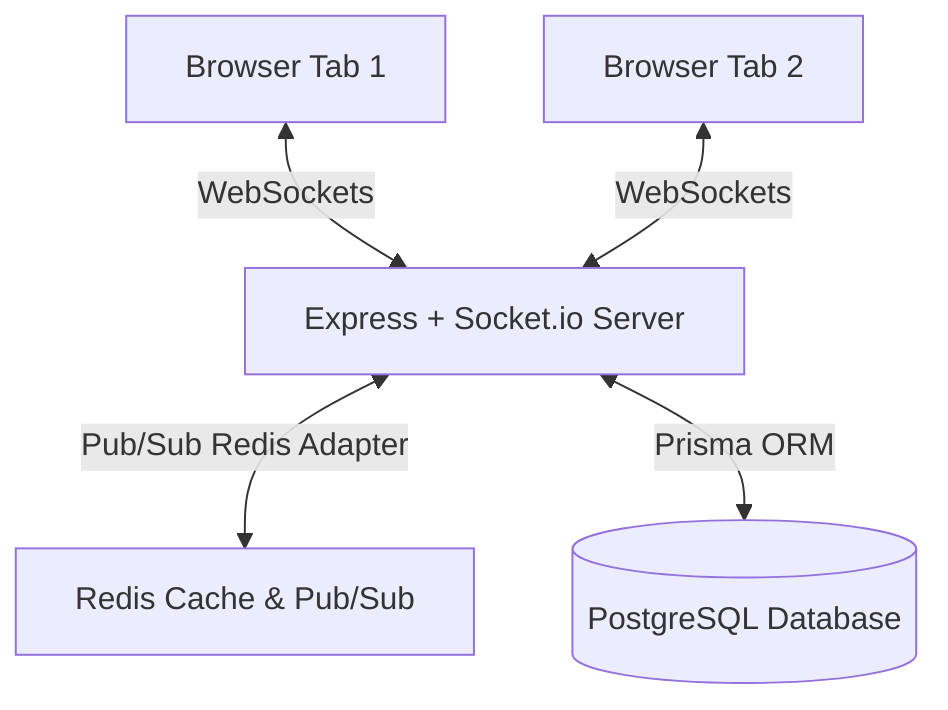

# FlowMind — Real-Time Collaborative Kanban Board with Autonomous AI Project Manager

FlowMind is a modern, real-time collaborative project management workspace. It features an automated, autonomous AI Project Manager that audits team velocity, detects development bottlenecks, predicts sprint completion risks, and compiles executive weekly summaries.

---

## 🏗 Real-Time Synchronization Architecture

FlowMind uses a hybrid WebSocket and Redis architecture to achieve instant collaborative updates across multiple active browser sessions.



### Key Components
1. **WebSockets (Socket.io)**: Clients join board-specific rooms (`board:{boardId}`) immediately upon opening the workspace. All card dragging, column restructuring, and board operations are transmitted via socket events.
2. **Redis Adapter**: Connects Socket.io instances using a Redis Pub/Sub backend. This allows FlowMind to scale horizontally across multiple node processes or host servers while maintaining unified event broadcasting.
3. **Database Fallback**: In local development environments, if no `REDIS_URL` is set, the socket server falls back gracefully to standard in-memory socket adapters.

---

## 🔒 Concurrency Control & Conflict Resolution

FlowMind implements a robust **Optimistic UI with Last-Write-Wins (LWW) Version Locking** to handle multiple users updating cards simultaneously.

### The Conflict Resolution Flow
1. **Version Tracking**: Every `Card` in the database holds a `version` field (initialized to `0`).
2. **Optimistic Dragging**: When a user drags a card, the frontend updates the layout instantly (optimistic state). It then emits a socket event `card:move` passing the version it has cached.
3. **Atomic Verification**: The server performs an atomic check. If another user moved the card in the interim, the database `version` will be higher than the client's payload.
4. **Rejection & Reversion**: The server rejects the outdated update, emits `card:move:failed` back to the sender, and broadcasts the current state. The sender's client displays a conflict toast and snaps the card back to its actual database position.

### Atomic Database Lock Implementation
To completely prevent race conditions during highly concurrent requests (e.g. if two requests read the version simultaneously before the database UPDATE executes), FlowMind uses atomic PostgreSQL conditional updates:

```javascript
// backend/src/socket.js
const updateResult = await prisma.card.updateMany({
  where: {
    id: cardId,
    version: version // Ensures update only happens if version matches the client's version
  },
  data: {
    columnId,
    position: parseFloat(position),
    version: { increment: 1 } // Atomically increments version by 1
  }
});

if (updateResult.count === 0) {
  // Stale version: update failed. Resolve conflict and return failure.
}
```

---

## 🤖 AI Project Manager & Audit Schedules

FlowMind integrates an autonomous project manager leveraging **Groq API (Llama-3.3-70b)** for intelligent sprint audits.

### 1. Six-Hourly Board Audits (`0 */6 * * *`)
Every 6 hours, background cron jobs scan active boards for:
* **Bottleneck Detection**: Compares the rate of cards entering versus leaving each column over the past 7 days. If the entry rate outpaces exit rates by **1.5x**, the column is flagged as congested.
* **Sprint Risk Indexing**: Analyzes velocity (cards moved to the final `Done` column per day). If the remaining task complexity outweighs the predicted team output within the sprint window, the board status is flagged as `HIGH_RISK`.
* **Token Streaming**: Users can trigger manual status reports on-demand in the UI. These are calculated and streamed token-by-token using **Server-Sent Events (SSE)** via `/api/boards/:id/ai-stream`.

### 2. Weekly Executive Summaries (`0 9 * * 1`)
Scheduled every Monday at 9:00 AM, the AI compiles a detailed executive report outlining:
1. **Weekly Velocity Trends**: Comparative metrics of tasks completed this week vs the previous week.
2. **Bottlenecks**: A narrative identifying blocked columns and team assignees holding congested items.
3. **Productivity Metrics**: Task completion rates grouped by assignee.
4. **Digest Reports Storage**: Narratives are saved to the `DigestReport` database table and browsed in the client's **Weekly Digests** sliding drawer.

---

## 📥 GitHub Issues Scraper

FlowMind enables product managers to import software issues directly from public GitHub repositories into their boards.

* **Pagination Handling**: Recursively fetches issues using standard cursor pagination (`page=N&per_page=100`) from the GitHub API until an empty result is returned.
* **Label & Assignee Auto-Mapping**: Reads GitHub issue labels and matches them to existing board labels (creating new ones if missing). Map assignees to board user profiles by email/name searches.
* **De-duplication Key**: Avoids duplicate card creations by using a unique compound constraints lock:
  $$\text{dedupKey} = (\text{githubIssueNumber}, \text{githubRepoUrl}, \text{boardId})$$

---

## 📊 Concurrent User Test Results

FlowMind's real-time conflict handling was stressed under simulated heavy loads.

### Test Environment
* **Database**: PostgreSQL (v16)
* **Backend**: Express + Socket.io (listening on port `3001`)
* **Test Tool**: Custom Node script spawning 10 concurrent socket clients ([concurrent-test.js](file:///Users/vyshrawanp/Documents/FlowMind/backend/src/scripts/concurrent-test.js)).

### Test Strategy
* **Simulated Users**: 10 simultaneous WebSocket client connections.
* **Stress Load**: 5 rounds of concurrent racing updates. In each round, all 10 clients attempt to move the *same* card to alternating target columns using the *same initial version* at the exact same millisecond (total of **50 simultaneous card move operations**).

### Execution Results
Run the test script in the backend directory:
```bash
npm run test:concurrency
```

| Metric | Result | Status |
| :--- | :--- | :--- |
| **Total Sockets Connected** | 10 | Connected |
| **Total Moves Emitted** | 50 | Emitted |
| **Successful Database Updates** | 5 | Expected (exactly 1 per round) |
| **Conflict Denials Caught** | 45 | Expected (exactly 9 per round) |
| **Unresolved / Server Errors** | 0 | Expected (0 failures) |

**Conclusion**: The test verified that FlowMind successfully resolves concurrency racing. Stale client updates are cleanly rejected, keeping database states consistent and preventing client visual desynchronizations.
