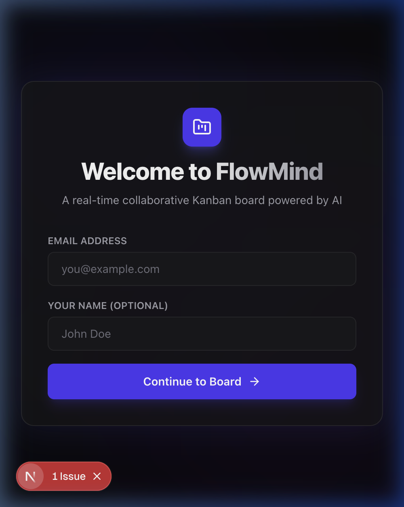
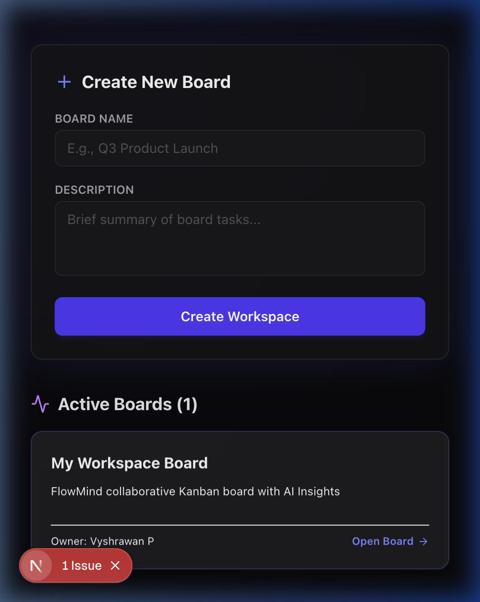
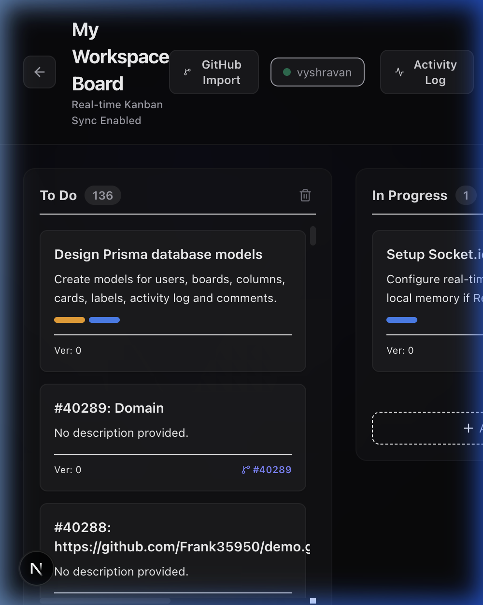
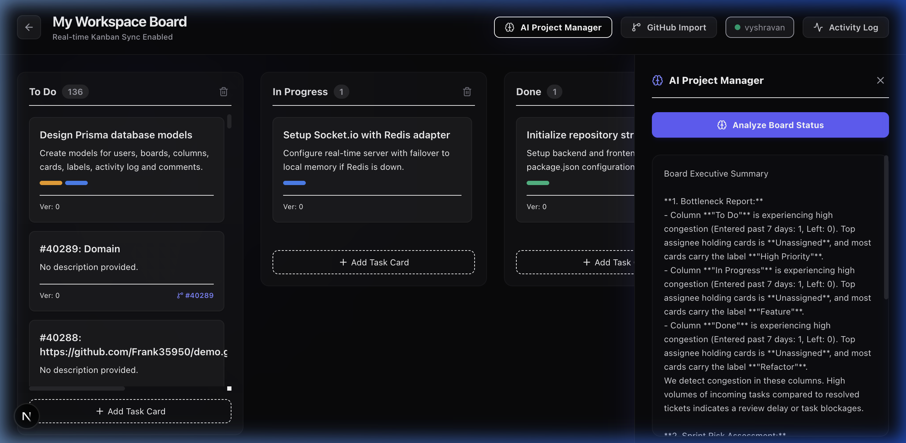
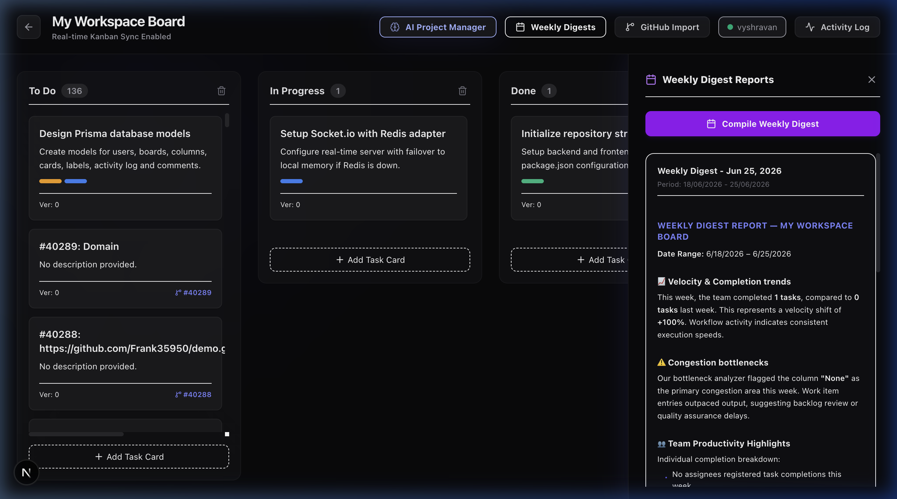
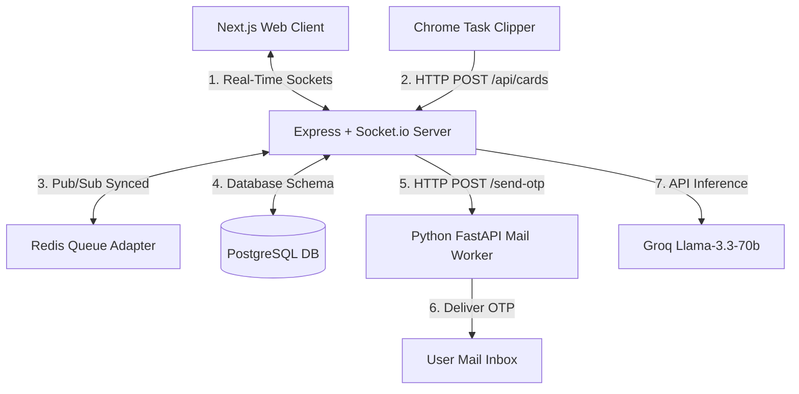
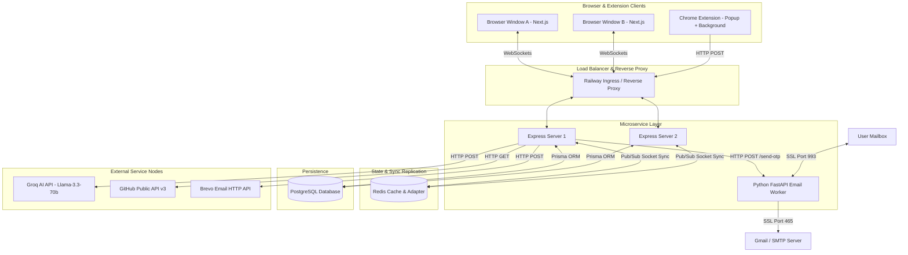
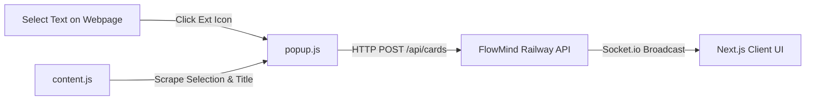

# 🌌 FlowMind

### 🔗 Live Production Demo: [https://flowmind-frontend-production-e15c.up.railway.app/login](https://flowmind-frontend-production-e15c.up.railway.app/login)

[](https://nodejs.org/)
[](https://nextjs.org/)
[](https://fastapi.tiangolo.com/)
[](https://www.postgresql.org/)
[](https://redis.io/)
[](https://railway.app)

> A modern, real-time collaborative Kanban workspace featuring an **Autonomous AI Project Manager** that audits board health, predicts sprint risks, estimates task complexity, and schedules weekly digests. Syncs with GitHub and features a Chrome extension to capture tasks from anywhere on the web.

---

## 📸 Product Screenshots

### Sign In Screen


### Workspace Dashboard


### Kanban Board Workspace (GitHub Imported)


### AI PM Telemetry insights


### Weekly Executive Digests


---

## ✨ Key Features

* ⚡ **Real-Time Collaboration**: Drag-and-drop cards and edit columns with instant synchronization across all active browser windows using Socket.io and Redis.
* 🤖 **Autonomous AI Project Manager**: Powered by **Llama-3.3-70b via Groq**, our AI PM runs background checks to detect bottleneck columns, flag sprint risks, predict task complexity, and stream insights.
* 🔒 **Optimistic UI & Concurrency**: Employs integer-based **Optimistic Concurrency Control (OCC)** to reject stale edits and prevent concurrent update overwrites.
* 🐙 **GitHub Scraper**: Import issues directly from any public GitHub repository with automatic label mapping, assignee resolution, pagination, and deduplication.
* 🧩 **Chrome Extension**: Clip highlight snippets, full-page summaries, and URLs from any website straight into your Kanban boards in real time.
* 🐍 **Python Mail Microservice**: A dedicated FastAPI worker that handles SMTP/IMAP verification protocols and parses OTPs using Regex for E2E tests.
* ✉️ **Brevo HTTPS REST Bypass**: Integrates Brevo's HTTPS REST API over port `443` to bypass cloud firewalls and send emails to any recipient without requiring a custom domain.

---

## 🏗 System Architecture



### Detailed Network Topology



---

## 🔒 Concurrency Control & Conflict Resolution (OCC)

FlowMind implements **Optimistic Concurrency Control (OCC)** using integer versioning. This guarantees that concurrent operations on the same task card (e.g. User A editing details while User B drags the card to another column) are resolved atomically without database corruption or silent overrides.

### Sequence Flow: Concurrent Drag and Drop Update

```mermaid
sequenceDiagram
    autonumber
    actor UserA as User A (Browser)
    actor UserB as User B (Browser)
    participant Server as Socket.io Server (Express)
    database DB as PostgreSQL DB

    Note over UserA, UserB: Both users hold Card 42 (Version: 5)
    
    UserA->>UserA: Moves card to 'In Progress' (Optimistic UI)
    UserA->>Server: Emit 'card:move' (Card ID: 42, Version: 5, Target: In Progress)
    
    UserB->>UserB: Moves card to 'Done' (Optimistic UI)
    UserB->>Server: Emit 'card:move' (Card ID: 42, Version: 5, Target: Done)

    Note over Server: Server processes User A first
    Server->>DB: UPDATE Card SET columnId='In Progress', version=6 WHERE id=42 AND version=5
    DB-->>Server: Success (1 row updated)
    Server-->>UserA: Emit 'card:move:success' (Acknowledge)
    Server->>UserB: Broadcast 'card:moved' (Card ID: 42, Version: 6, Col: In Progress)

    Note over Server: Server processes User B
    Server->>DB: UPDATE Card SET columnId='Done', version=6 WHERE id=42 AND version=5
    DB-->>Server: Failed (0 rows updated - version mismatch)
    Server-->>UserB: Emit 'card:move:failed' (Version Conflict)
    UserB->>UserB: Revert Optimistic UI: Card snaps back to 'In Progress'
    UserB->>UserB: Show Toast: "Conflict detected. Card state updated to latest version."
```

---

## 🤖 AI Project Manager & Scheduling

The background AI PM agent acts as a virtual Scrum Master, analyzing boards on a configurable schedule:

### 1. Bottleneck Scoring Methodology
Every column's congestion index ($C$) is calculated by the background worker:
$$C = \frac{\text{Cards Entered in Last 7 Days}}{\text{Cards Completed/Moved out in Last 7 Days}}$$
* If $C \ge 1.5$ and column task counts exceed 5, a **bottleneck** is declared.
* The AI is triggered with the board state, analyzing assignee work limits, labels, and dependencies to pinpoint the root cause (e.g. an overloaded assignee).

### 2. Sprint Risk Assessment Mathematical Formula
When a sprint deadline is set, the system calculates the required daily velocity ($V_{\text{req}}$) vs actual velocity ($V_{\text{act}}$):
$$V_{\text{req}} = \frac{\text{Remaining Story Points on Board}}{\text{Days Left in Sprint}}$$
$$V_{\text{act}} = \frac{\text{Story Points Completed in Last 7 Days}}{7}$$
* **High Risk**: $V_{\text{act}} < 0.8 \times V_{\text{req}}$ (The team is moving too slowly to make the deadline).
* **Medium Risk**: $0.8 \times V_{\text{req}} \le V_{\text{act}} < V_{\text{req}}$
* **On Track**: $V_{\text{act}} \ge V_{\text{req}}$

### 3. Task Complexity Inference
Using **Groq Llama-3.3-70b**, the system analyzes the title, description, and tags when a card is created. It compares these with completed tasks and suggests a story point (1, 2, 3, 5, 8) with a written justification.

---

## 🗄️ 4. Database Schema Domain Model (Prisma)

The application domain maps directly to PostgreSQL through the following relationship hierarchy:

```
+---------------+      1:N      +---------------+      1:N      +---------------+
|     User      |-------------->|  ActivityLog  |<--------------|     Board     |
+---------------+               +---------------+               +---------------+
        |                                                               |
        | 1:N (Owner)                                                   | 1:N
        v                                                               v
+---------------+                                               +---------------+
|     Board     |                                               |    Column     |
+---------------+                                               +---------------+
        |                                                               |
        | 1:N                                                           | 1:N
        v                                                               v
+---------------+                                               +---------------+
|    Column     |                                               |     Card      |
+---------------+                                               +---------------+
```

---

## 📡 5. Key API Contracts

### 🔐 Authentication

#### 1. Registration (`POST /api/auth/signup`)
* **Request**:
  ```json
  {
    "email": "user@example.com",
    "password": "securepassword",
    "name": "Alex Mercer"
  }
  ```
* **Response (201 Created)**:
  ```json
  {
    "message": "Account created. Verification OTP code sent to your email.",
    "email": "user@example.com"
  }
  ```

#### 2. OTP Verification (`POST /api/auth/verify-otp`)
* **Request**:
  ```json
  {
    "email": "user@example.com",
    "otpCode": "123456"
  }
  ```
* **Response (200 OK)**:
  ```json
  {
    "message": "OTP verification successful. Account is active.",
    "token": "eyJhbGciOiJIUzI1NiIsInR5cCI6IkpXVCJ9...",
    "user": {
      "id": "547dff98-85f5-4c0c-9422-c3e3220b08a3",
      "email": "user@example.com",
      "name": "Alex Mercer",
      "role": "USER"
    }
  }
  ```

---

## 🧩 6. Chrome Extension Architecture

The Chrome Extension is structured using Google Manifest V3 specifications. It clips page details and communicates directly with your backend:



### Manifest Configuration (`manifest.json`)
```json
{
  "manifest_version": 3,
  "name": "FlowMind Clipper",
  "version": "1.0",
  "description": "Clip tasks from any webpage into your FlowMind Kanban boards.",
  "permissions": ["activeTab", "scripting"],
  "action": {
    "default_popup": "popup.html",
    "default_icon": "icon.png"
  },
  "content_scripts": [
    {
      "matches": ["<all_urls>"],
      "js": ["content.js"]
    }
  ]
}
```

---

## 🚀 Installation & Local Development

Follow the step-by-step setup in the [Quick Start Guide](#quick-start--installation) above to run each service (Backend, Next.js Frontend, Python Mail Worker, Chrome Extension) locally.
