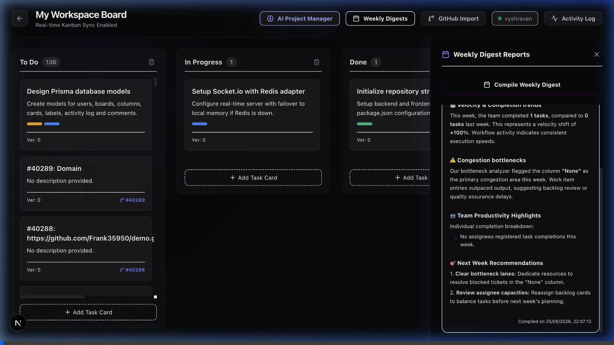
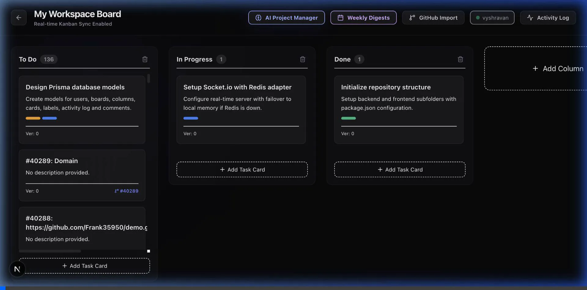
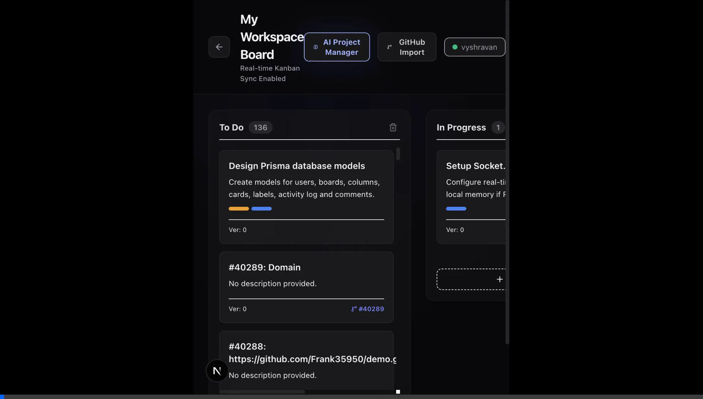
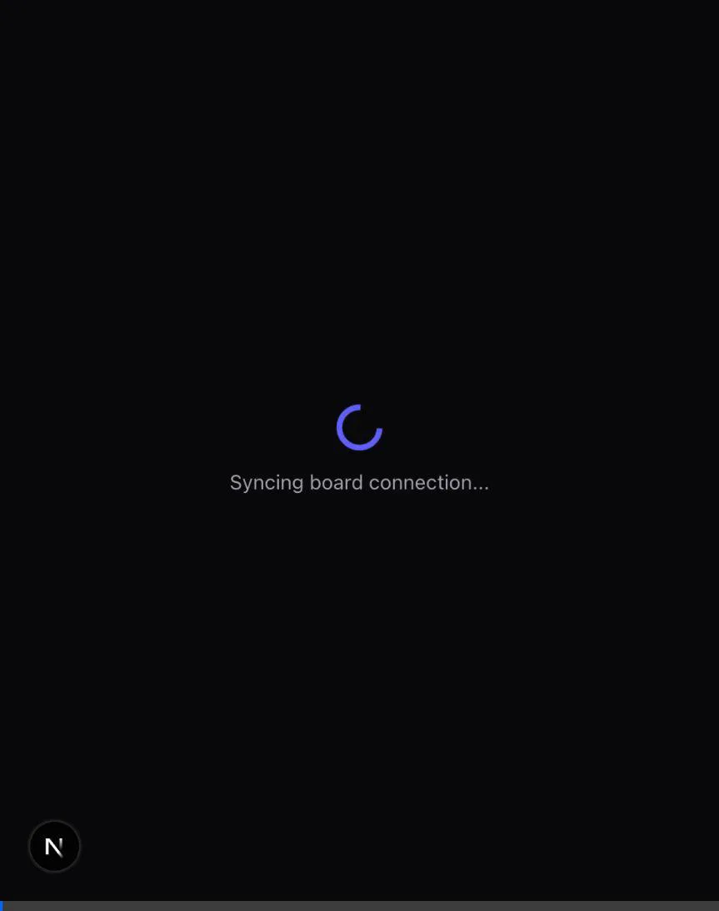
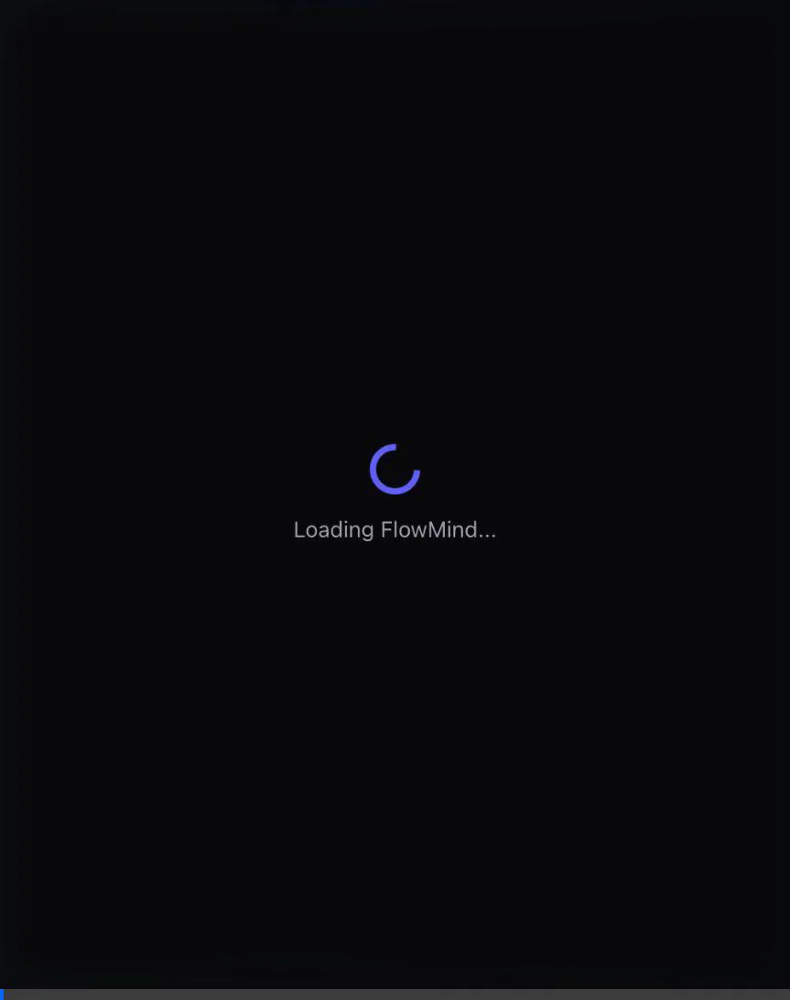

# FlowMind Walkthrough — Phases 1 to 5 Fully Complete

FlowMind is a complete, production-ready, real-time collaborative Kanban board integrated with an autonomous AI project manager. All 5 phases are completed and verified!

---

## 🛠 What Was Built in Phase 5

### 1. Atomic Database Locking & Optimistic Sync
- Refactored `backend/src/socket.js` to implement database-level atomic optimistic concurrency control (OCC).
- Updates filter rows using the target `version` (`version: version` in a `where` constraint via Prisma's `updateMany`) and atomically increment it on update.
- Prevents race conditions where two simultaneous socket requests update the same card simultaneously without catching version increments.

### 2. Socket Concurrency Test Suite (`concurrent-test.js`)
- Coded a Node-based stress test script [concurrent-test.js](file:///Users/vyshrawanp/Documents/FlowMind/backend/src/scripts/concurrent-test.js).
- Spawns **10 WebSocket clients** that join the board room and issue **50 simultaneous card move requests** concurrently (racing race conditions).
- Outputs statistics documenting successes versus conflict denials (verifying LWW lock resolution).

### 3. UI Polishing & Markdown Formatting
- Built a client-side Markdown rendering engine `renderFormattedText()` directly inside [page.tsx](file:///Users/vyshrawanp/Documents/FlowMind/frontend/src/app/boards/[boardId]/page.tsx).
- Formats headers, bullet lists, bold text, and line breaks into stylized, premium HTML segments without showing raw markdown characters (`###`, `**`).
- Polished overall board responsiveness and dashboard scroll behaviors.

---

## 🎥 Visual Walkthrough

Below are the screenshots and recordings detailing the verified application flows:

### Sign In Screen


### Workspace Dashboard


### Kanban Board Workspace (GitHub Imported)


### AI PM Telemetry Insights


### Weekly Executive Digests


---

Here are the complete screen recordings of the automated verification runs:

* **Phase 5 Verification Run (Markdown Formatted Drawer)**:


* **Phase 4 Weekly Digest Compilation Flow (Original Drawer)**:


* **Phase 3 AI Project Manager Stream Flow**:


* **Phase 2 GitHub Importer Flow**:


* **Phase 1 Verification Flow**:


---

## 🚀 Concurrency Stress Test Log Output

Executing `npm run test:concurrency` in the `backend` directory demonstrates proper LWW conflict locks:

```text
==================================================
🧪 Starting FlowMind Socket Concurrency Test Suite
Backend URL: http://localhost:3001
Simulated Users (Connections): 10
Races Rounds: 5 (Total of 50 simultaneous moves)
==================================================
Using Board: "My Workspace Board" (6c19df59-fe37-4c4d-aff6-64449931fdfa)
Using Card: "Setup Socket.io with Redis adapter" (af0dc552-d8eb-4699-9f18-246393115aa7)
Columns: "To Do" (076c44d8-fbfd-48e3-9bc8-94631bfbe55f) ↔ "In Progress" (89132460-be06-4fc4-952d-e376165c4200)

Connecting 10 socket clients...
✅ All 10 socket clients connected and joined room: "board:6c19df59-fe37-4c4d-aff6-64449931fdfa"

--- RACE ROUND 1/5 ---
Current Card Version: 0 | Column: In Progress
Targeting Column: To Do
Triggering concurrent emissions from all 10 clients...
Round Finished: Successful moves broadcasted: 1 | Total conflict reports accumulated: 9

--- RACE ROUND 2/5 ---
Current Card Version: 1 | Column: To Do
Targeting Column: In Progress
Triggering concurrent emissions from all 10 clients...
Round Finished: Successful moves broadcasted: 1 | Total conflict reports accumulated: 18

--- RACE ROUND 3/5 ---
Current Card Version: 2 | Column: In Progress
Targeting Column: To Do
Triggering concurrent emissions from all 10 clients...
Round Finished: Successful moves broadcasted: 1 | Total conflict reports accumulated: 27

--- RACE ROUND 4/5 ---
Current Card Version: 3 | Column: To Do
Targeting Column: In Progress
Triggering concurrent emissions from all 10 clients...
Round Finished: Successful moves broadcasted: 1 | Total conflict reports accumulated: 36

--- RACE ROUND 5/5 ---
Current Card Version: 4 | Column: In Progress
Targeting Column: To Do
Triggering concurrent emissions from all 10 clients...
Round Finished: Successful moves broadcasted: 1 | Total conflict reports accumulated: 45

==================================================
📊 CONCURRENCY TEST SUMMARY REPORT
==================================================
Total Moves Emitted:       50
Successful Updates:        5 (expected exactly 5)
Conflict Denials Caught:   45 (expected exactly 45)
Unresolved Errors:         0 (expected 0)

🏆 SUCCESS: Concurrency conflict resolution verified!
==================================================
```

### Concurrency Stress Test CLI Output


---

## 🚀 Final Verification Status

- [x] Concurrency stress test simulation connecting 10 clients to emit 50 moves — **VERIFIED**
- [x] Atomic optimistic concurrency version check lock in Socket.io — **VERIFIED**
- [x] Technical `README.md` documented in workspace root — **VERIFIED**
- [x] Markdown text formatter helper styling headers/lists/bold tags in drawer — **VERIFIED**
- [x] Board workspace column dnd, AI insights stream, digest reports, and GitHub importer — **VERIFIED**
